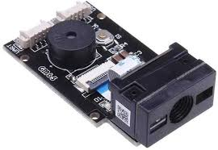
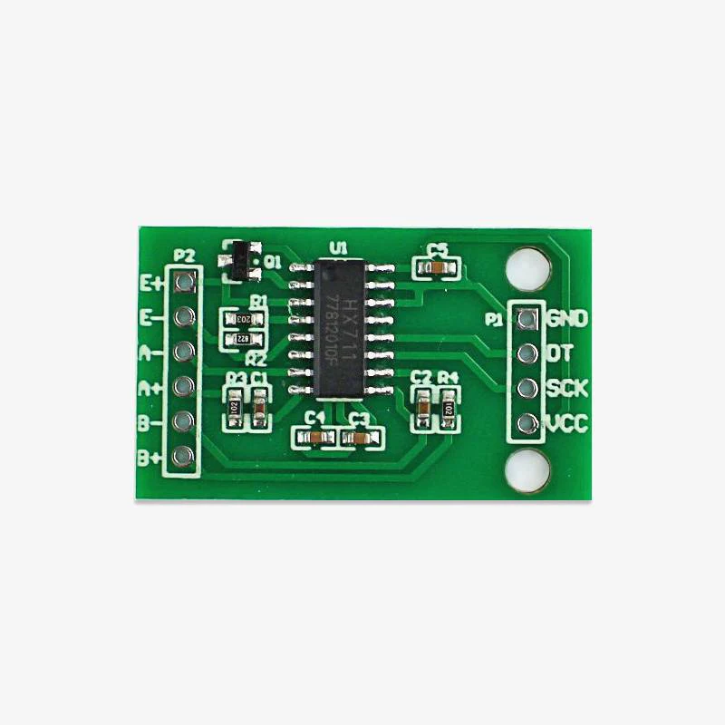
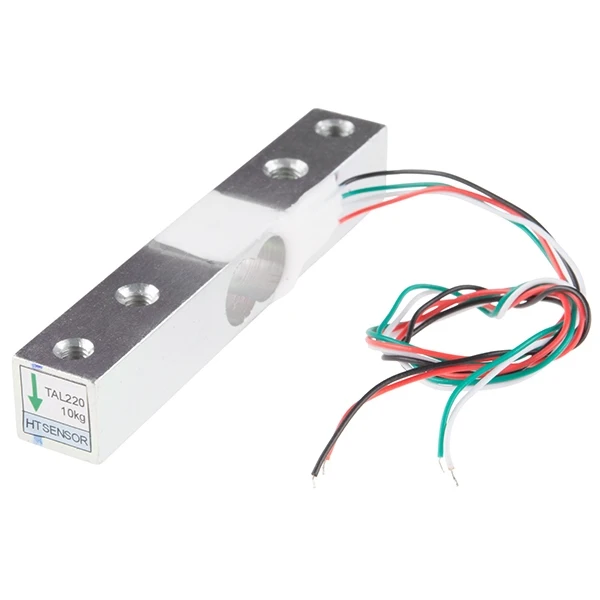
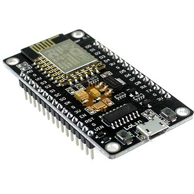
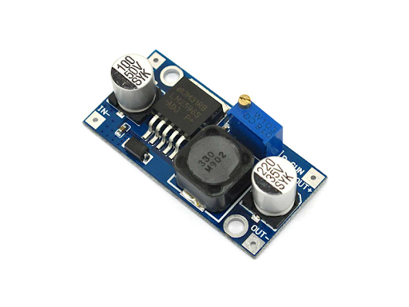
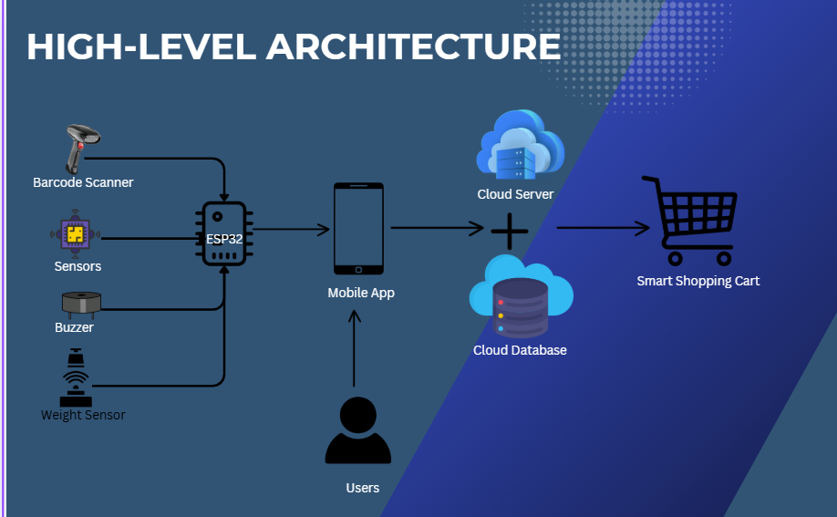

[comment]: # "This is the standard layout for the project, but you can clean this and use your own template"

# Smart Shopping Cart

---

## Team
-  E/20/062, Dhananji K.S, [email](mailto:e20062@eng.pdn.ac.lk)
-  E/20/035, K.C.H.N.A.W.M.R.C.J.N.Bandara, [email](mailto:e20035@eng.pdn.ac.lk)
-  E/20/318, R.A.D.J.I.Ranawaka, [email](mailto:e20318@eng.pdn.ac.lk)
-  E/20/397, P.D.Thilakasiri, [email](mailto:e20397@eng.pdn.ac.lk)

<!-- Image (photo/drawing of the final hardware) should be here -->

<!-- This is a sample image, to show how to add images to your page. To learn more options, please refer [this](https://projects.ce.pdn.ac.lk/docs/faq/how-to-add-an-image/) -->

<!--  -->

#### Table of Contents
1. [Introduction](#introduction)
2. [Problem Statement](#problem-statement)
3. [Motivation](#motivation)
4. [Proposed Solution](#proposed-solution)
5. [High Level Arcitecture](#high-level-architecture)
6. [Hardware & Software Designs](#hardware-and-software-designs)
7. [Testing](#testing)
8. [Detailed budget](#detailed-budget)
9. [Conclusion](#conclusion)
10. [Links](#links)

## Introduction

Our Smart Shopping Cart leverages sensors and RFID technology to transform the shopping experience. It ensures effortless item tracking, personalized assistance, and real-time insights, simplifying shopping for customers while empowering retailers with valuable data.

## Problem statement

long checkout queues.
difficulty in tracking spending during shopping, 
inefficiency in navigating stores to locate items. 
customers lack a seamless way to view their complete bill in real-time.

## Motivation

Long queues and delays at checkout counters cause frustration for shoppers.

Customers struggle to track spending during shopping, leading to budget concerns.

Navigating large stores to find items is time-consuming and inefficient.

## Proposed Solution

**Web App for Shop Owners:** Shop management can design the shop layout through the web app and manager has the ability to register other users to the cart like cashiers. In the cashier part when cashier adds the cart id and user id all the cart items and the real time bill is rendered. Then cashier verify the checkout process and can release the cart. 

**Smart Cart Module:** Smart cart module with a integrated barcode scanner, load cell and navigation somponents. Customer is guided to all the items in the shopping list and when customer shop an item real time bill is displayed in the mobile app. 

**User Side Features:** Customer is able to add intended shopping list via mobile app and can track his spendings realtime all the time. 

**Enhanced Checkout Process:** If customer trying to pass the checkout without any checking out process buzzer will sound on. If all the weight verification and checkout process successfull it is free to move the cart. 

## Hardware and Software Designs

Hardware components used

<table>
  <tr>
    <td align="center">
       
      GM65 Barcode Scanner
    </td>
    <td align="center">
       
      HX711 Load Cell
    </td>
  </tr>
  <tr>
    <td align="center">
       
      Load Cell
    </td>
    <td align="center">
       
      ESP8266
    </td>
  </tr>
  <tr>
    <td align="center">
       
      Buck Converter
    </td>
    <td align="center">
       
      Li-Ion Rechargeable Battery
    </td>
  </tr>
</table>

## High Level Architecture

## Detailed budget

All items and costs

| Item          | Quantity  | Unit Cost   | Total     |
| ------------- |:---------:|:----------: |-------:   |
| ESP32         | 2        | 1740 LKR     | 3480 LKR  |
| RFID reader and RFID tags        | 1         | 450 LKR    | 450 LKR  |
| Active Buzzer       | 1         | 400 LKR    | 400 LKR  |
| gm65 Barcode Scanner       | 1         | 8200.00 LKR    | 8200.00 LKR  |
| HX711 Load Cell       | 1         | 1290.00 LKR    | 1290.00 LKR  |
| 10kg Load Cell        | 1         | 1340.00 LKR    | 1340.00 LKR  |
| Li-Ion Battery        | 3         | 250.00 LKR    | 750.00 LKR  |
| Step-Down Converter        | 1         | 960.00 LKR  | 960.00 LKR  |

## Conclusion

The **Smart Shopping Cart** project successfully demonstrates how IoT and modern embedded systems can transform the traditional shopping experience. By integrating hardware components such as barcode scanners, load cells, and microcontrollers with a responsive web and mobile application ecosystem, we created a seamless system for real-time item tracking, billing, and checkout.

Key outcomes of the project include:

- A functioning smart cart prototype with item scanning, real-time weight monitoring, and mobile bill tracking.
- A cashier-facing web application for managing carts and customer checkouts.
-A mobile app that allows customers to add shopping lists and monitor their expenses in real time.
- An automated alert system that ensures security at the checkout point by verifying purchase completion.

### Future Improvements

- Integration with payment gateways for fully automated, cashless checkout.
- Advanced indoor navigation using beacons or vision systems to improve pathfinding.
- Improved sensor fusion for more accurate weight detection
- UI/UX enhancements in mobile and web interfaces
- Scaling the system to support multi-store environments and centralized data analytics.

### Commercialization Potential

With further development and refinement, this system can be scaled and deployed in modern supermarkets to reduce queue times, improve efficiency, and enhance customer satisfaction. It offers strong potential as a smart retail automation solution.

## Links

- [Project Repository](https://github.com/cepdnaclk/{e20-3yp-Smart-Shopping-Cart}){:target="[projectRepo](https://github.com/cepdnaclk/e20-3yp-Smart-Shopping-Cart)"}
- [Project Page](https://cepdnaclk.github.io/{e20-3yp-Smart-Shopping-Cart}){:target="[ProjectPaage](https://cepdnaclk.github.io/e20-3yp-Smart-Shopping-Cart/)"}
- [Department of Computer Engineering](http://www.ce.pdn.ac.lk/)
- [University of Peradeniya](https://eng.pdn.ac.lk/)

[//]: # (Please refer this to learn more about Markdown syntax)
[//]: # (https://github.com/adam-p/markdown-here/wiki/Markdown-Cheatsheet)
